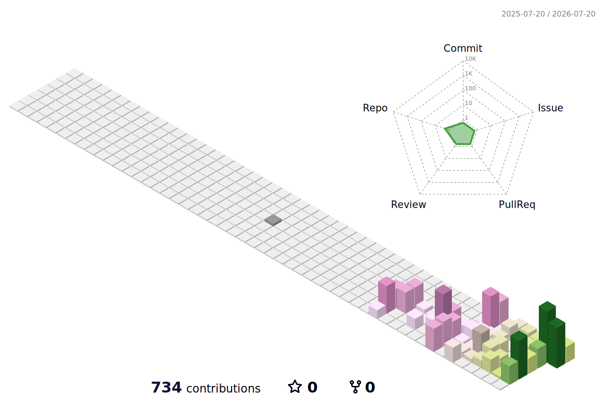

# Ichiro Shimamoto (Riceball-0427) 👋

  

  <strong>Proxmox VEやVPS、Dockerコンテナを用いたインフラ構築・サービス開発を楽しむ専門職大学生 / 見習いインフラエンジニア</strong>

  

---

## 🙋‍♂️ About Me

高校時代にはゲーム系のプログラミングを学んでいましたが、そこからインフラ、ネットワーク、そしてセキュリティの深さに強く惹かれ、現在は情報系の専門職大学で情報セキュリティを専攻しています！

自宅の **Proxmox VE** によるプライベートクラウドや、各種レンタルVPS上で **Docker** コンテナを用いたサービス構築・運用を行い、日夜「動くインフラ」を創る楽しさに没頭しています。

- 🎓 **学業**: 情報系専門職大学（セキュリティ分野専攻）
- 🛡️ **興味領域**: ネットワークセキュリティ、アイデンティティ管理（IdP/OIDC/SAML）、コンテナオーケストレーション、ホームラボ構築
- 🚀 **モットー**: 「エンジニアでなくても直感的・安全に保守運用できるインフラ・プラットフォームの実現」

---

## 🛠️ Tech Stack & Skills

> シックなパステルカラーで統一されたモダンなスキルセットです。

### 🌐 Infrastructure & DevOps

  
  
  
  
  
  
  
  

### 🔑 Security & Identity

  
  
  

### 💻 Languages & Frameworks

  
  
  
  
  
  

---

## 🚀 Featured Projects (注力した代表作)

採用選考やポートフォリオとしてアピールしたい、技術的工夫を凝らした主要プロジェクトです。

### 1. 🔑 OmusuBI (Open Source Identity Orchestrator)
> 独立したIDプロバイダー（IdP）や認証プロトコルをひとつのコントロールプレーンに統合するID認証ポータル基盤

| 項目 | 内容 |
| :--- | :--- |
| **概要** | 複雑な認証プロトコル（OIDC, SAML, LDAP等）を裏側に隠蔽し、非エンジニアの運用担当者でもWeb画面から直感的にユーザー管理、権限アサイン、コンテキストポリシー（接続元、MFA強度などによる制御）を保守・管理できるようにしたID連携オーケストレーターです。 |
| **使用技術** | **Keycloak**, **Go**, OpenID Connect, SAML 2.0, **Caddy (Forward Auth)**, **Tailscale**, **Cloudflare Tunnel**, Proxmox VE |
| **インフラ工夫点** | ポート開放を行えないセキュアなプライベートクラウド（Proxmox）環境から、Cloudflare TunnelとTailscaleのメッシュネットワークを駆使して外部VPS（OpenStack）上のWebアプリへ安全にID連携（SAML Federation）するトポロジーを設計・実装しました。 |

### 2. 📦 CNT-Connect (Unified IT Assets & Provisioning Platform)
> 社内備品管理、キッティング、MDMを統合し、リソース管理コストを削減する管理ポータル

| 項目 | 内容 |
| :--- | :--- |
| **概要** | 各企業で個別管理されがちなPC・デバイスなどの社内ハードウェア備品管理と、それらに紐づくMDM（モバイルデバイス管理）や自動キッティングプロビジョニングシステムをワンストップで統合・一元管理できるWebプラットフォームです。 |
| **使用技術** | **TypeScript**, **React**, **Next.js**, **NestJS (Node.js)**, **PostgreSQL**, **Docker**, Playwright (E2Eテスト) |
| **開発/インフラ工夫点** | **npm workspaces**を用いたモノレポ構成を採用し、スキーマ定義やAPIコントラクトを共通化してチーム開発の生産性を向上。Dockerを用いたローカル・ステージング検証環境の整備に加え、**Playwright**を活用したCIテストの自動化によりリリースの信頼性を高めました。 |

---

## 📊 GitHub Contribution & Stats

### 🗺️ 3D Contribution Graph

  <picture>
    <source media="(prefers-color-scheme: dark)" srcset="profile-3d-contrib/profile-night-rainbow.svg" />
    <source media="(prefers-color-scheme: light)" srcset="profile-3d-contrib/profile-season-animate.svg" />
    
  </picture>

### 👾 Contribution Snake Game

  <picture>
    <source media="(prefers-color-scheme: dark)" srcset="https://raw.githubusercontent.com/Riceball-0427/Riceball-0427/output/github-contribution-grid-snake-dark.svg" />
    <source media="(prefers-color-scheme: light)" srcset="https://raw.githubusercontent.com/Riceball-0427/Riceball-0427/output/github-contribution-grid-snake.svg" />
    
  </picture>

### 📈 Metrics & Stats

  <picture>
    <source media="(prefers-color-scheme: dark)" srcset="output/metrics.svg" />
    <source media="(prefers-color-scheme: light)" srcset="output/metrics.svg" />
    
  </picture>

---

## 📬 Connect & Contact

気になる技術のお話や、インフラ・セキュリティに関する議論など、お気軽にご連絡ください！

- 📝 **ブログ**: [Note](https://note.com/riceball_0427)
- 🐦 **X (Twitter)**: [@ONIGIRI15236050](https://x.com/ONIGIRI15236050)
- 💚 **Qiita**: [@Riceball-0427](https://qiita.com/Riceball-0427)
- 💙 **Zenn**: [@riceball_5427](https://zenn.dev/riceball_5427)
- 📸 **Instagram**: [@riceball_5427](https://www.instagram.com/riceball_5427)
- 📘 **Facebook**: [riceball5427](https://www.facebook.com/riceball5427)
- 📧 **メール**: [info@nigiri-rice.com](mailto:info@nigiri-rice.com)

---

  <em>Thank you for visiting my profile! Happy Hacking 💻</em>

